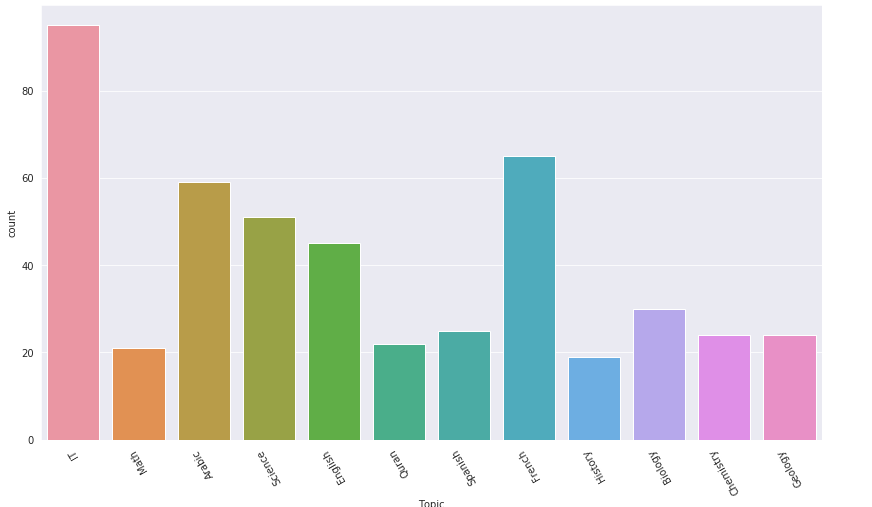

# Student performance analysis

The main aim of this project is to perform exploratory data analysis of an educational dataset using python and also build a model that will be able to predict students performances based on some features.

## Requirements

The following packages are required to run the code :
- **Python 3.7+**

- **NumPy** (`pip install numpy`)

- **pandas** (`pip install pandas`)

- **MatplotLib** (`pip install matplotlib`)

- **Seaborn** (`pip install seaborn`)

- **scikit-learn** (`pip install scikit-learn`)

## List of files

- _**education_project.ipynb**_ : This is a jupyter notebook which contains
all the codes and explanations related to the analysis.

## Analysis of the dataset

We perform EDA to find answers to the follwoing questions :

- Where do the students currently enrolled in the online classes come from? What are the male to female ratios?
- What is the general distribution of education levels of students? Is there any gender bias?
- What are the popular topics among students?
- Is there any influence coming from the background of a student on topic selection?
- How popular are the topics in different countries that the students come from?
- What factors affect the grade of a student?
- How do female students perform compared to male student?
- How do students perform in different topics?
- How satisfied parents are with each school of study.

We also build a simple classification model which, given a bunch of features related to a student, will be able to predict how the student will perform.

## External link

The project is done as a part of [Dataset Daily](https://www.datasetdaily.com) weekly projects.

Data Sources: [Kalboard Learning Management System](https://www.kaggle.com/aljarah/xAPI-Edu-Data)

## Citation(s)
Elaf Abu Amrieh, Thair Hamtini, and Ibrahim Aljarah, The University of Jordan, Amman, Jordan.
